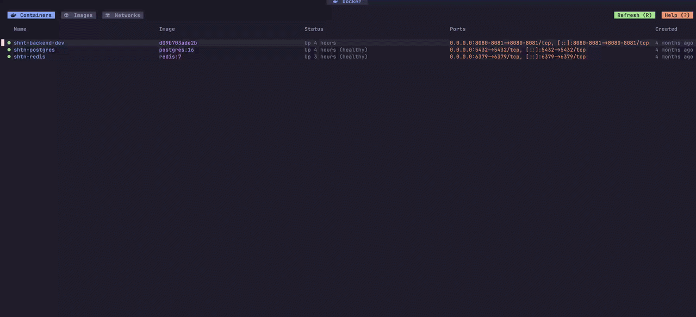

# Dockyard.nvim

A powerful and interactive Docker management tool for Neovim, designed for a fast and efficient development workflow.

> [!CAUTION]
> **Still in early development, will have breaking changes!**

<div>
  
</div>

## Features

- **Container Management**: View all containers with status indicators. Start, stop, restart, and remove containers using single-key commands.
- **Image Explorer**: Interactive list of images grouped by repository. Supports removing images and pruning dangling data.
- **Network Topology**: View Docker networks and their connected containers in a structured tree view.
- **LogLens**: Stream logs from containers or specific log files inside containers. Support for custom Lua parsers and JSON highlighting.
- **Integrated Shells**: Open a terminal inside any running container directly from the dashboard.

### Using [lazy.nvim](https://github.com/folke/lazy.nvim)

```lua
{
  "emrearmagan/dockyard.nvim",
  dependencies = { 
    "nvim-lua/plenary.nvim",
    "akinsho/toggleterm.nvim", -- Optional: for persistent shells
  },
  config = function()
    require("dockyard").setup({
      -- See configuration below
    })
  end,
  cmd = { "Dockyard", "DockyardFull" },
}
```

## Configuration

```lua
require("dockyard").setup({
  display = {
    refresh_interval = 5000, -- Auto-refresh interval in ms
    view_order = { "containers", "images", "networks" },
  },
  loglens = {
    max_lines = 2000,
    containers = {
      ["nginx"] = {
        {
          name = "Docker Logs",
          type = "docker", -- Use "docker" for stdout/stderr or "file" for log files
          -- path = "/var/log/app.log", -- Only required for type = "file"
          format = "json",

          -- Main list parser: controls how each log line looks in the buffer
          parser = function(line)
            local ok, obj = pcall(vim.json.decode, line)
            if not ok then return nil end

            return {
              -- The text displayed in the log window
              row = string.format("%s [%s] %s", obj.timestamp, obj.level:upper(), obj.message),
              
              -- Apply custom highlights to the row
              highlight = function(buf, lnum)
                local hl = obj.level == "error" and "ErrorMsg" or "Identifier"
                vim.api.nvim_buf_add_highlight(buf, -1, hl, lnum, 0, -1)
              end
            }
          end,

          -- Detail parser: controls what appears in the popup window when pressing 'o'
          detail_parser = function(line)
            local ok, obj = pcall(vim.json.decode, line)
            if not ok then return { line } end
            
            -- Return a table of strings for the detail popup
            return {
              "Level:   " .. obj.level,
              "TraceID: " .. (obj.trace_id or "N/A"),
              "Payload: " .. vim.inspect(obj.payload)
            }
          end
        }
      }
    }
  }
})
```

## Commands

- `:Dockyard` - Open the UI in a split
- `:DockyardFull` - Open the UI in a new tab

## License

MIT License - see [LICENSE](LICENSE) for details.
