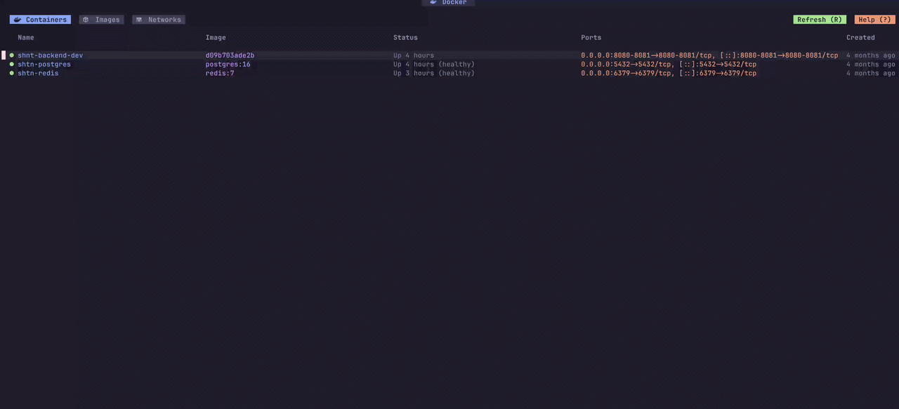

# Dockyard.nvim

A powerful and interactive Docker management tool for Neovim, designed for a fast and efficient development workflow.

> [!CAUTION]
> **Still in early development, will have breaking changes!**

<div>
  
</div>

## Features

- **Container Management**: View all containers with status indicators. Start, stop, restart, and remove containers using single-key commands.
- **Image Explorer**: Interactive list of images grouped by repository. Supports removing images and pruning dangling data.
- **Network Topology**: View Docker networks and their connected containers in a structured tree view.
- **LogLens**: Stream logs from containers or specific log files inside containers. Full control over formatting and syntax highlighting.
- **Integrated Shells**: Open a terminal inside any running container directly from the dashboard.

## Installation

### Using [lazy.nvim](https://github.com/folke/lazy.nvim)

```lua
{
  "emrearmagan/dockyard.nvim",
  dependencies = { 
    "nvim-lua/plenary.nvim",
    "akinsho/toggleterm.nvim", -- Optional: for persistent shells
  },
  config = function()
    require("dockyard").setup({
      -- See configuration below
    })
  end,
  cmd = { "Dockyard", "DockyardFloat" },
}
```

## Configuration

### Minimal Setup

```lua
require("dockyard").setup({})
```

With no configuration, LogLens uses sensible defaults:
- Fetches logs from Docker stdout/stderr
- Auto-detects JSON vs plain text
- Shows raw log lines

### Full Configuration

```lua
require("dockyard").setup({
  display = {
    views = { "containers", "images", "networks" },
  },
  loglens = {
    max_lines = 2000,   -- Max lines to keep in memory
    follow = true,      -- Auto-scroll to new logs
    tail = 100,         -- Lines to fetch on open

    default_source = {
      type = "docker",  -- "docker" or "file"
      parser = "auto",  -- "auto", "json", or "text"
    },

    containers = {
      -- Per-container configuration (see LogLens section below)
    },
  },
})
```

## LogLens Configuration

LogLens gives you **full control** over how logs are displayed and highlighted.

### Basic Example: JSON Logs

```lua
containers = {
  ["my-backend"] = {
    sources = {
      {
        name = "Backend Logs",
        type = "file",
        path = "/var/log/backend.json",
        parser = "json",

        -- Format: how each row looks
        format = function(entry)
          local ts = entry.timestamp and entry.timestamp:sub(12, 19) or "--:--:--"
          local lvl = (entry.level or "info"):upper()
          return string.format("%s [%s] %s", ts, lvl, entry.message or "")
        end,

        -- Highlights: what to color
        highlights = {
          { pattern = "%d%d:%d%d:%d%d", group = "Comment" },
          { pattern = "%[ERROR%]", group = "ErrorMsg" },
          { pattern = "%[WARN%]", group = "WarningMsg" },
          { pattern = "%[INFO%]", group = "Identifier" },
        },
      },
    },
  },
},
```

### Basic Example: Plain Text Logs

```lua
containers = {
  ["nginx"] = {
    sources = {
      {
        name = "Access Log",
        type = "file",
        path = "/var/log/nginx/access.log",
        parser = "text",

        format = function(entry)
          return entry.raw  -- Show line as-is
        end,

        highlights = {
          -- HTTP status codes
          { pattern = '" 2%d%d ', color = "#50fa7b" },   -- 2xx green
          { pattern = '" 4%d%d ', color = "#ffb86c" },   -- 4xx orange
          { pattern = '" 5%d%d ', color = "#ff5555" },   -- 5xx red
          -- IPs
          { pattern = "%d+%.%d+%.%d+%.%d+", group = "Comment" },
        },
      },
    },
  },
},
```

### LogLens Options Reference

#### Source Options

| Option | Type | Description |
|--------|------|-------------|
| `name` | string | Display name for the source |
| `type` | `"docker"` \| `"file"` | Where to get logs |
| `path` | string | File path (required if `type = "file"`) |
| `parser` | `"auto"` \| `"json"` \| `"text"` | How to parse lines |
| `fields` | table | JSON field mapping (see below) |
| `format` | function | Format function: `entry → string` |
| `highlights` | table | Highlight rules (see below) |

#### Parser Types

| Parser | `entry` contains | Use case |
|--------|------------------|----------|
| `"json"` | `.level`, `.message`, `.timestamp`, `.raw` | JSON logs |
| `"text"` | `.raw` only | Plain text logs |
| `"auto"` | Detects per-line | Mixed logs |

#### JSON Field Mapping

Different logging frameworks use different field names. Use `fields` to map them:

```lua
-- Your JSON: {"lvl":"info","msg":"Hello","ts":"2026-01-01"}
fields = {
  level = "lvl",       -- Maps "lvl" → entry.level
  message = "msg",     -- Maps "msg" → entry.message
  timestamp = "ts",    -- Maps "ts" → entry.timestamp
},
```

#### Highlight Rules

Each rule matches a Lua pattern and applies a color:

```lua
highlights = {
  -- Use Neovim highlight group
  { pattern = "%[ERROR%]", group = "ErrorMsg" },
  { pattern = "%[WARN%]", group = "WarningMsg" },
  
  -- Use custom hex color
  { pattern = "%[CRITICAL%]", color = "#ff0000" },
  { pattern = "https?://[%w%.%-/]+", color = "#8be9fd" },
}
```

#### Common Lua Patterns

| Pattern | Matches | Example |
|---------|---------|---------|
| `%[ERROR%]` | Literal `[ERROR]` | `[ERROR] failed` |
| `%d%d:%d%d:%d%d` | Time HH:MM:SS | `14:32:05` |
| `%d+%.%d+%.%d+%.%d+` | IP address | `192.168.1.1` |
| `https?://[%w%.%-/]+` | URLs | `https://example.com` |
| `'" %d%d%d '` | HTTP status | `" 200 "`, `" 404 "` |

### Multiple Sources per Container

A container can have multiple log sources:

```lua
["my-app"] = {
  sources = {
    {
      name = "Docker Output",
      type = "docker",
      parser = "auto",
      format = function(entry) return entry.raw end,
      highlights = {},
    },
    {
      name = "App Log",
      type = "file",
      path = "/var/log/app.log",
      parser = "json",
      format = function(entry)
        return string.format("[%s] %s", entry.level, entry.message)
      end,
      highlights = {
        { pattern = "%[error%]", group = "ErrorMsg" },
      },
    },
  },
},
```

## Commands

| Command | Description |
|---------|-------------|
| `:Dockyard` | Open the UI fullscreen |
| `:DockyardFloat` | Open the UI in a floating window |

## License

MIT License - see [LICENSE](LICENSE) for details.
